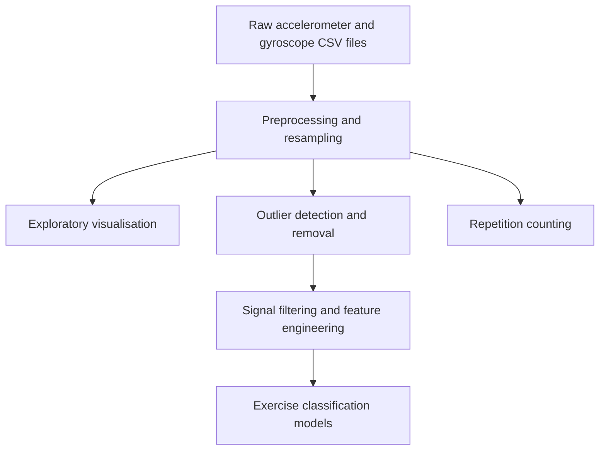

# Wearable Sensor Exercise Classification and Repetition Counting

An end-to-end machine-learning project that transforms raw accelerometer and gyroscope readings into exercise predictions and repetition estimates. The workflow covers preprocessing, exploratory analysis, outlier removal, signal processing, feature engineering, model comparison, and evaluation.

## Problem Statement

Wearable motion sensors generate multivariate time-series data that can be used to understand physical activity. This project investigates whether sensor readings can:

1. Classify five strength-training exercises: bench press, overhead press, squat, deadlift, and row.
2. Distinguish medium and heavy workout sets.
3. Estimate exercise repetitions from movement patterns.

## Project Workflow



## Main Techniques

- Time-series resampling and sensor-data merging
- IQR, Chauvenet's criterion, and Local Outlier Factor
- Butterworth low-pass filtering
- Principal Component Analysis
- Temporal rolling-window features
- Fourier-transform frequency features
- K-Means clustering features
- Forward feature selection and hyperparameter search
- Random Forest, Decision Tree, KNN, Naive Bayes, and neural-network comparison
- Local-extrema-based repetition analysis

## Repository Structure

```text
wearable-sensor-exercise-classification/
├── README.md
├── requirements.txt
├── .gitignore
├── data/
│   ├── raw/
│   │   └── README.md
│   └── interim/
│       └── .gitkeep
├── reports/
│   └── figures/
│       └── .gitkeep
└── src/
    ├── data/
    │   └── 01_data_preprocessing.ipynb
    ├── visualization/
    │   └── 02_data_visualization.ipynb
    ├── features/
    │   ├── 03_outlier_detection.ipynb
    │   ├── 04_feature_engineering.ipynb
    │   ├── 05_counting_repetitions.ipynb
    │   ├── DataTransformation.py
    │   ├── TemporalAbstraction.py
    │   └── FrequencyAbstraction.py
    └── models/
        ├── 06_train_model.ipynb
        └── LearningAlgorithms.py
```

The helper modules shown above are required by the notebooks and must be included in the repository.

## Notebook Pipeline

| Order | Notebook | Purpose | Main output |
|---:|---|---|---|
| 1 | `01_data_preprocessing.ipynb` | Combines accelerometer and gyroscope CSV files, labels sessions, resamples the signals, and creates workout sets | `01_data_processed.pkl` |
| 2 | `02_data_visualization.ipynb` | Explores exercises, participants, set intensity, and individual sensor axes | Figures |
| 3 | `03_outlier_detection.ipynb` | Compares multiple outlier-detection methods and removes selected anomalies | `02_outlier_removed_df.pkl` |
| 4 | `04_feature_engineering.ipynb` | Applies low-pass filtering, PCA, temporal abstraction, Fourier features, and clustering | `03_feature_eng.pkl` |
| 5 | `05_counting_repetitions.ipynb` | Analyses exercise-specific signals for repetition counting | Rep-count analysis |
| 6 | `06_train_model.ipynb` | Compares classifiers, performs feature selection, tunes models, and evaluates predictions | Accuracy and confusion matrices |

The repetition-counting notebook is a separate branch of the workflow and can be run after preprocessing.

## Model Results

The training notebook reports a best Random Forest test accuracy of approximately **99.48%** on a stratified random train-test split. A separate participant-focused evaluation reports approximately **98.45%** accuracy.

These results should be interpreted with care because time-series observations from the same workout set can be highly related. A stronger production-style evaluation would split the data by participant or complete workout set before training to reduce leakage risk.

## Installation

1. Clone the repository:

   ```bash
   git clone https://github.com/your-username/wearable-sensor-exercise-classification.git
   cd wearable-sensor-exercise-classification
   ```

2. Create and activate a virtual environment:

   ```bash
   python -m venv .venv
   source .venv/bin/activate
   ```

   On Windows:

   ```powershell
   .venv\Scripts\activate
   ```

3. Install the dependencies:

   ```bash
   pip install -r requirements.txt
   ```

4. Add the raw MetaMotion sensor files under `data/raw/MetaMotion/`. See `data/raw/README.md` for the expected layout.

5. Start Jupyter:

   ```bash
   jupyter notebook
   ```

6. Run the numbered notebooks in sequence.

## Generated Data

The pipeline generates intermediate Pandas pickle files under `data/interim/`. These files are excluded from version control because they can be regenerated by running the notebooks.

The notebooks use relative paths such as `../../data/interim/`. Keep the documented directory structure unchanged or update the paths before running them.

## Technologies

- Python
- NumPy and Pandas
- Matplotlib and Seaborn
- SciPy signal processing
- Scikit-learn
- Jupyter Notebook

## Limitations and Next Steps

- Validate models using participant-wise or group-based cross-validation.
- Convert repeated notebook logic into reusable Python modules.
- Save the trained model and preprocessing pipeline.
- Add automated tests for transformations and feature calculations.
- Create an inference API or lightweight dashboard.
- Complete exercise-specific peak tuning and report repetition-counting error.
- Add reproducible package versions after validating the project in a clean environment.

## Acknowledgements

This is a guided learning project based on Dave Ebbelaar's YouTube series, [Full Machine Learning Project: Coding a Fitness Tracker with Python](https://www.youtube.com/playlist?list=PL-Y17yukoyy0sT2hoSQxn1TdV0J7-MX4K).

The project structure, dataset workflow, and core methodology follow the series. I reproduced the implementation, executed and analysed each stage, and documented the results and validation limitations to strengthen my practical understanding of wearable-sensor data processing and machine learning.

## Author

**Nitish Malik**  
Data Analytics | Python | Machine Learning
